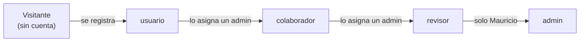
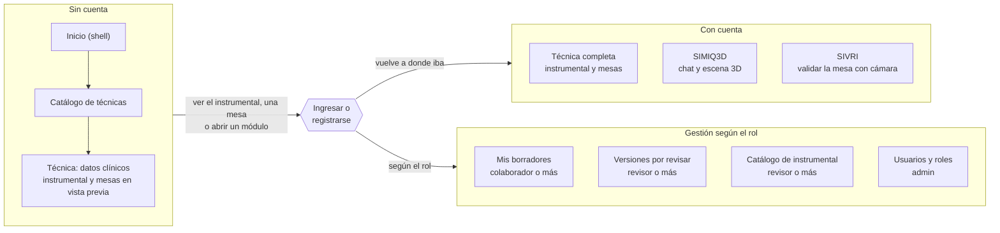
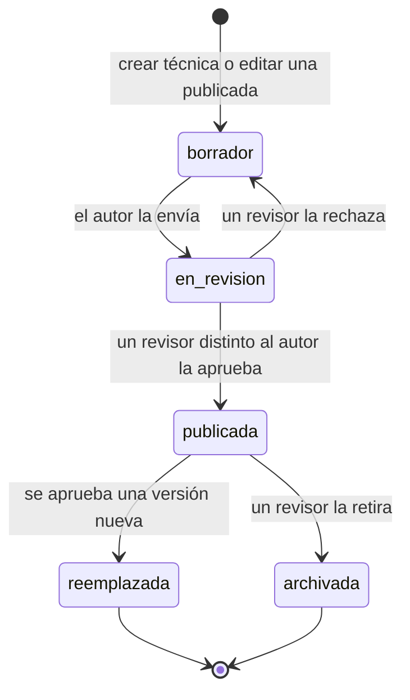
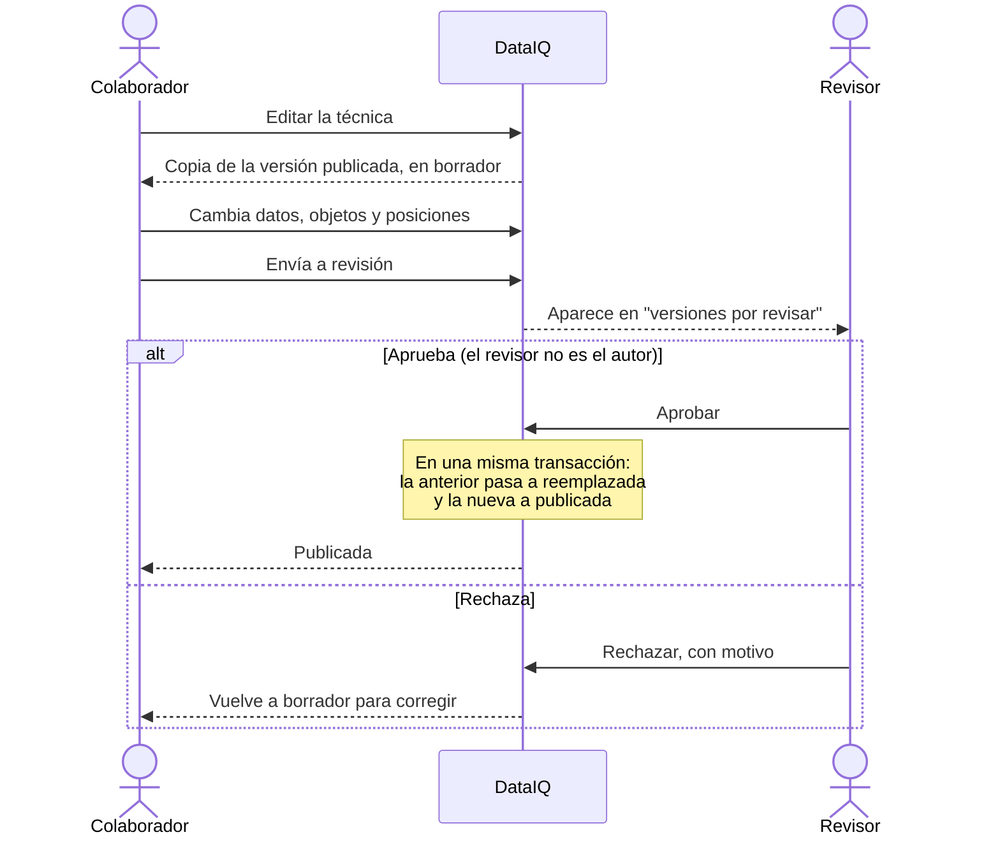
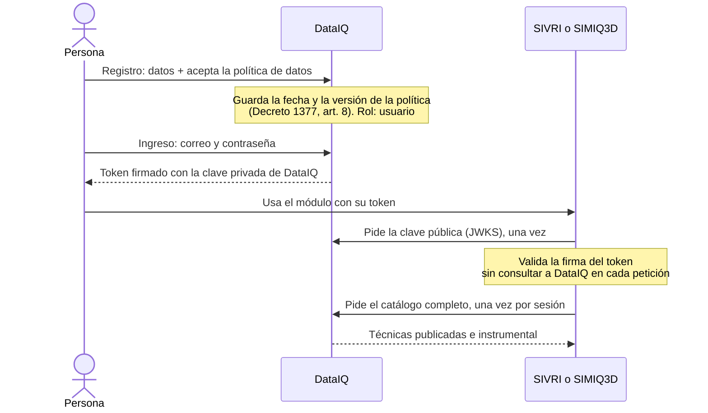

# Flujos del ecosistema

Diagramas de cómo se usa el ecosistema: quién puede hacer qué, por dónde navega
cada persona y cómo una técnica pasa de borrador a publicada. Los diagramas
están en [Mermaid](https://mermaid.js.org/): GitHub los dibuja al abrir este
archivo.

El detalle de cada rol está en el "Modelo de roles" de
[`CLAUDE.md`](../CLAUDE.md).

Hay una versión visual de estos diagramas, para presentar:
<https://claude.ai/artifact/779R1z8d3pd6srkbtiohpk> (privada; se comparte desde
su menú). Este archivo es la fuente: si cambia una decisión, se cambia primero
aquí y después la versión visual.

## 1. Roles

Los roles son acumulativos: cada uno puede todo lo del anterior. Cada cuenta
tiene un solo rol.

| Acción | Visitante | usuario | colaborador | revisor | admin |
|---|:-:|:-:|:-:|:-:|:-:|
| Entrar al shell y ver el catálogo de técnicas | ✔ | ✔ | ✔ | ✔ | ✔ |
| Ver los datos clínicos de una técnica | ✔ | ✔ | ✔ | ✔ | ✔ |
| Ver el instrumental y las mesas de una técnica | vista previa | ✔ | ✔ | ✔ | ✔ |
| Usar SIVRI y SIMIQ3D | | ✔ | ✔ | ✔ | ✔ |
| Funciones personales (p. ej. progreso en SIVRI) | | ✔ | ✔ | ✔ | ✔ |
| Crear técnicas y editar borradores | | | ✔ | ✔ | ✔ |
| Enviar un borrador a revisión | | | ✔ | ✔ | ✔ |
| Aprobar o rechazar versiones (nunca las propias) | | | | ✔ | ✔ |
| Archivar una técnica publicada | | | | ✔ | ✔ |
| Crear y editar instrumental | | | | ✔ | ✔ |
| Gestionar roles | | | | | ✔ |

## 2. Navegación

Sin cuenta se entra al shell, se ve qué técnicas hay y se abre cualquiera con
sus datos clínicos. Su instrumental y sus mesas se ven como vista previa (la
mesa en gris, sin números) y piden iniciar sesión o registrarse (gratis) ahí
mismo; usar SIVRI y SIMIQ3D también lo pide. Después del ingreso, la persona vuelve a donde
iba. La gestión aparece según el rol.

## 3. Ciclo de vida de una versión

Cada técnica tiene como máximo una versión publicada y una en curso
(`borrador` o `en_revision`). Las transiciones se validan en el dominio
(`app/dominio/tecnicas.py`).

## 4. Editar y aprobar una técnica

Editar una técnica publicada nunca la cambia: se trabaja sobre una copia en
borrador. Los estudiantes siguen viendo la versión publicada hasta que un
revisor aprueba la nueva.

## 5. Registro, ingreso y uso entre módulos

DataIQ es el único que emite tokens. SIVRI y SIMIQ3D no tienen tabla de
usuarios: solo validan la firma con la clave pública de DataIQ.

## Decisiones abiertas

- Cómo se autentican los backends de SIVRI y SIMIQ3D ante DataIQ para pedir el
  catálogo completo: con el token del usuario o con una clave propia del
  módulo.
